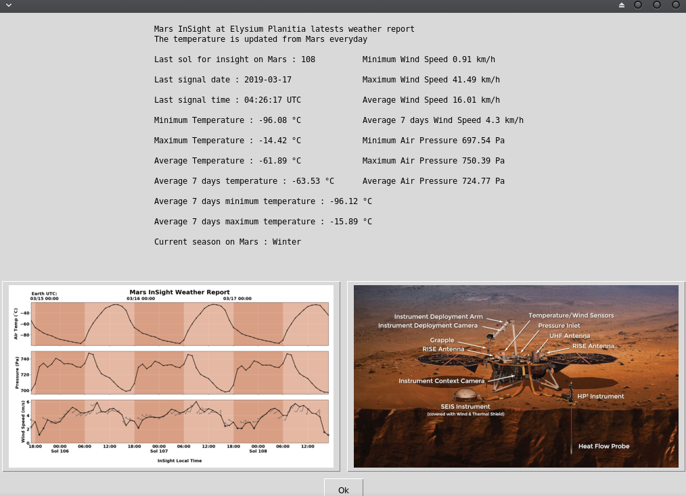

   

# Mars InSight Lastest Weather Report



## What's this software ?  

This python 3 software parse a json file and calcule the temperatures of Mars InSight. The Json file is updated everyday.

The data is downloaded from : https://mars.nasa.gov/insight/weather/

## Download the Windows .exe version :

You can run it with Python 3 and the right libraries or for Windows you can use the .exe software that I created there :

[](https://sourceforge.net/projects/mars-insight-weather-live/files/latest/download)

## What you need to make it work :  

The last version of Python 3.

you also need to have the easygui library for python 3:

At least the version 0.98

```sh
sudo python3 -m pip install --upgrade easygui 
```
You need wget for python 3:


```sh
sudo pip3 install wget
```

## How to launch this software :  

```sh
python3 MarsGUI.py
```  

## Requirements :

If you miss a module, install it with the command pip install module-name. For example if you miss PIL you can install it with : sudo pip3 install pillow.

Your user must have read and write access on the current running 
directory.

## Error - No data :

The average 7 days calculation need 7 days information. If the json file rawdata from insight contain less than 7 keys you will have an error like this :

Traceback (most recent call last):
  File "MarsGUI.py", line 161, in <module>
    parser()
  File "MarsGUI.py", line 86, in parser
    Last_Wnd2 = mars[sol_keys_new2]["HWS"]
KeyError: 'HWS'

Look at the this page to see if all the 7 days data are available : https://mars.nasa.gov/insight/weather/
## Developer - Author

Hamdy Abou El Anein

## Homepage

http://www.daylightlinux.ch 
