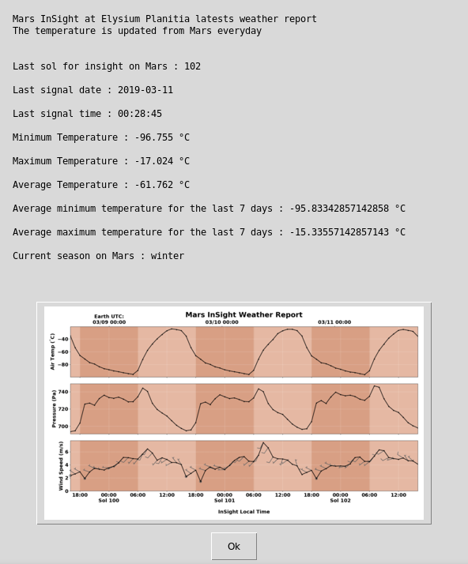

   

# Mars InSight Lastest Weather Report



## What's this software ?  

This python 3 software parse a json file and calcule the temperatures of Mars InSight. The Json file is updated everyday.

The data is downloaded from : https://mars.nasa.gov/insight/weather/

## What you need to make it work :  

The last version of Python 3.

you also need to have the easygui library for python 3:

At least the version 0.98

```sh
sudo python3 -m pip install --upgrade easygui 
```
You need wget for python 3:


```sh
sudo pip3 install wget
```

## How to launch this software :  

```sh
python3 MarsGUI.py
```  

## Operating System :

Linux only. 

This software make many OS commands that are only available in linux. 

You user must have read and write access on the current running directory.

## Developer - Author

Hamdy Abou El Anein

## Homepage

http://www.daylightlinux.ch 
